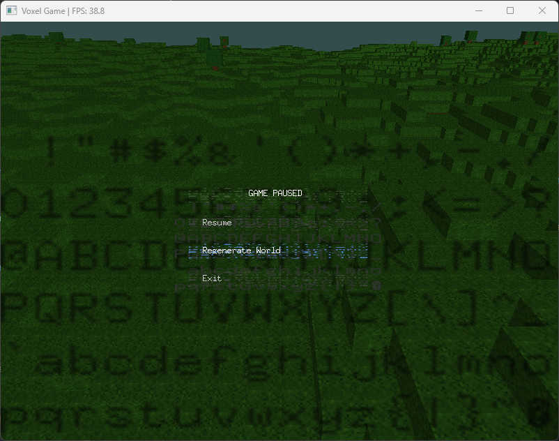
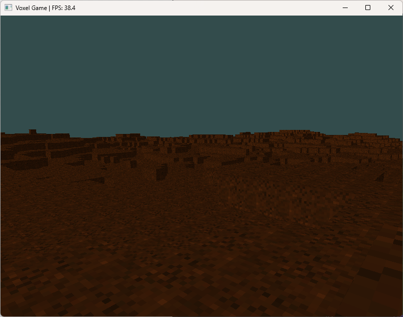
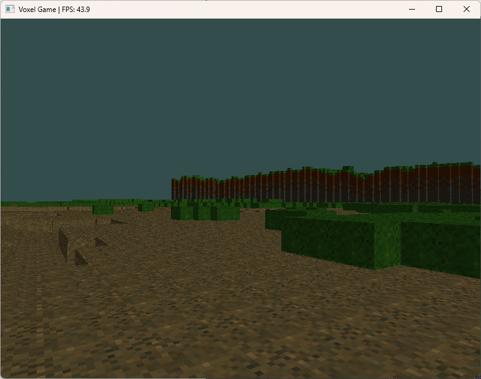
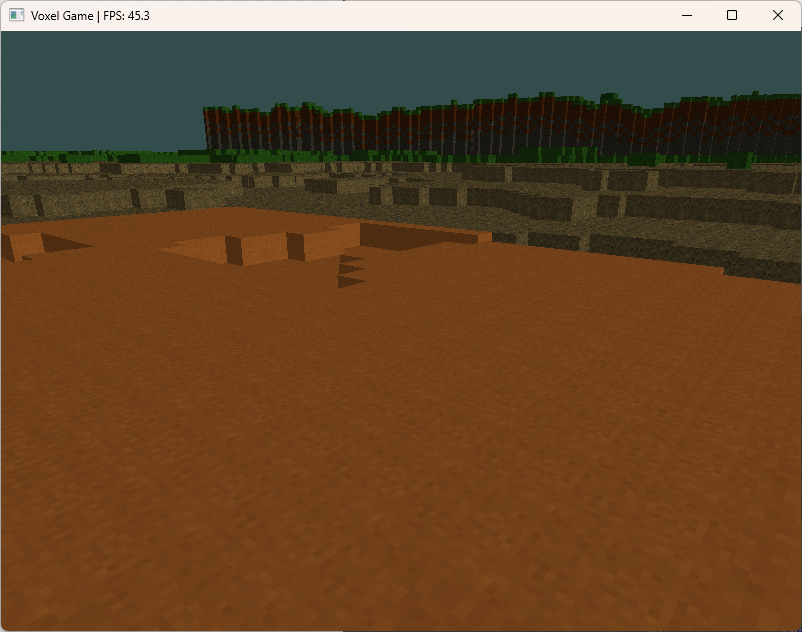
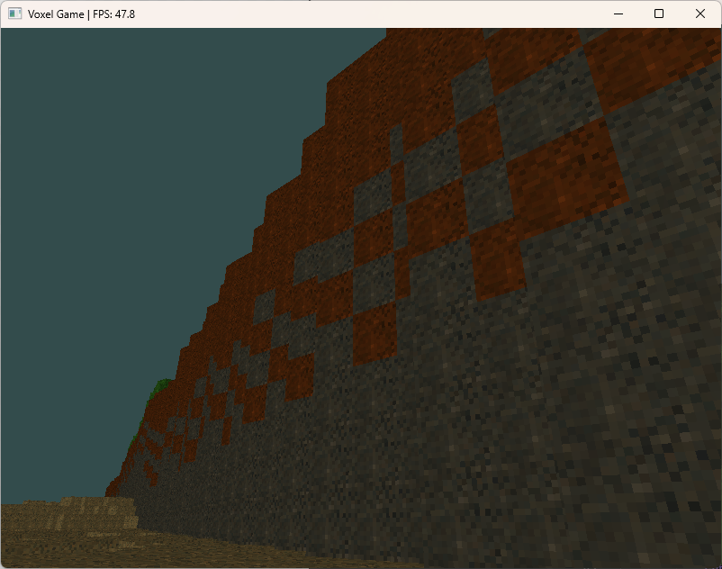
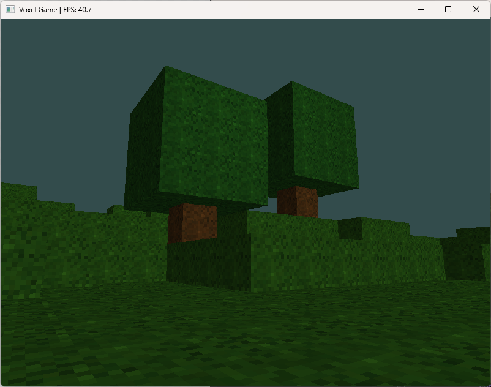
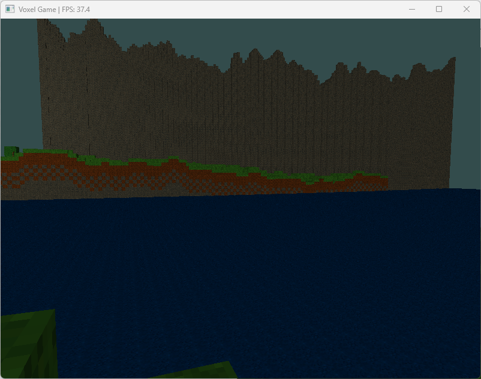

# Voxel Game

## Description

A 3D voxel-based game built with Go and OpenGL. This project implements a Minecraft-inspired world with procedural terrain generation, block manipulation, and a simple user interface.

## Features

- **Procedural Terrain Generation**: Dynamically generated world with different biomes
- **Block Manipulation**: Place and destroy blocks in the world
- **First-Person Camera**: Smooth camera controls for exploring the world
- **Texture Support**: Custom textures for different block types
- **Frustum Culling**: Efficient rendering of only visible chunks
- **Text Rendering**: UI system with font rendering
- **Lighting System**: Basic lighting with ambient, diffuse, and specular components

## Screenshots

### World Generation



### Blocks
#### Dirt

#### Gravel

#### Sand

#### Stone

#### Tree

#### Water


*Caption: Procedurally generated terrain with different block types*


## Installation

### Prerequisites

- Go 1.16 or higher
- OpenGL 4.1 compatible graphics card
- Git

### Steps

1. Clone the repository:
   ```bash
   git clone https://github.com/Ahuge/voxel-game-ai-generated.git
   cd voxel-game-ai-generated
   ```

2. Install dependencies:
   ```bash
   go mod download
   ```

3. Build and run the game:
   ```bash
   go build
   ./voxelgame  # On Windows: voxelgame.exe
   ```

## Controls

| Key           | Action                |
|---------------|----------------------|
| W, A, S, D    | Move                 |
| Space         | Jump                 |
| Right Click    | Destroy Block       |
| ESC           | Pause Menu           |
| Mouse         | Look Around          |

## Development

### Project Structure

- `main.go` - Entry point and game loop
- `world.go` - World management and chunk handling
- `chunk.go` - Chunk data structure and mesh generation
- `player.go` - Player movement and interaction
- `camera.go` - Camera controls and view matrices
- `shader.go` - OpenGL shader management
- `mesh.go` - Mesh generation and rendering
- `ui.go` - User interface elements
- `font.go` - Text rendering system
- `terrain_generator.go` - Procedural terrain generation
- `shaders/` - GLSL shader files
- `textures/` - Block and UI textures

### Adding New Block Types

To add new block types, modify the `block_types.go` file and add corresponding textures to the `textures/` directory.

### Modifying Terrain Generation

The terrain generation algorithm is defined in `terrain_generator.go`. You can adjust parameters to create different world types.

## Future Plans

- [ ] Multiplayer support
- [ ] More biomes and structures
- [ ] Day/night cycle
- [ ] Weather effects
- [ ] Mob AI and combat
- [ ] Crafting system
- [ ] Sound effects and music

## Contributing

Contributions are welcome! Please feel free to submit a Pull Request.

1. Fork the repository
2. Create your feature branch (`git checkout -b feature/amazing-feature`)
3. Commit your changes (`git commit -m 'Add some amazing feature'`)
4. Push to the branch (`git push origin feature/amazing-feature`)
5. Open a Pull Request

## License

This project is licensed under the MIT License - see the LICENSE file for details.

## Credits

- [Go-GL](https://github.com/go-gl/gl) - OpenGL bindings for Go
- [GLFW](https://github.com/go-gl/glfw) - Window and input management
- [MathGL](https://github.com/go-gl/mathgl) - Math library for OpenGL

---